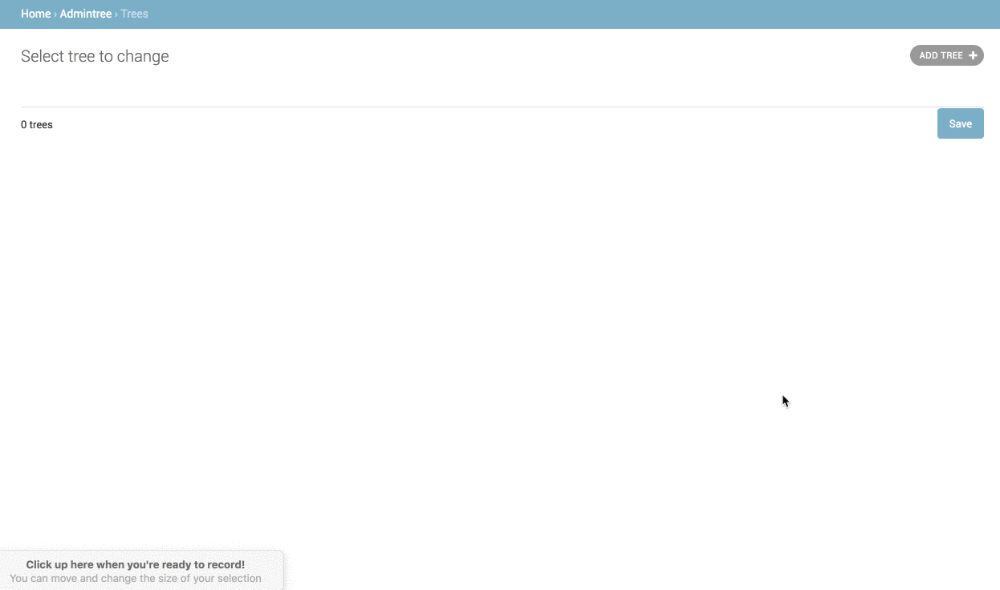

## Getting Started

Clone and add this app to your django project, change whatever you want, make migration and migrate, then go to admin and see result.

As you can see, there are two columns, left side is your trees, and right side is your nodes. You can add nodes to tree, remove nodes from tree(just drag from tree to right side), or change node order in tree and copy/move nodes between trees.
Only left side will be saved when you click save.

Also provide a simple api to return tree, check the code.
